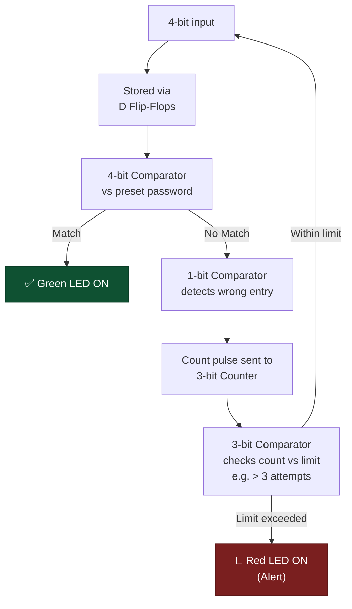

# 🔐 Combinational Lock with Alert Mechanism

### A Digital Logic Design Project — Secure Lock with Wrong-Attempt Tracking & Alert

---

## 📖 1. Overview

A secure digital lock built entirely from **combinational and sequential logic circuits** — no microcontroller involved. Beyond just password verification, the system tracks repeated wrong entries and triggers a visual alert once a threshold is exceeded, mimicking real-world lockout-style security behavior using pure logic design.

---

## 📌 2. Goal

To build a secure lock using combinational and sequential logic, with a warning system that activates after multiple invalid password entries.

---

## ⭐ 3. Highlights

- 🔢 Multiple wrong attempts tracking
- 🚨 Alert triggered after exceeding a wrong-attempt threshold
- 🔧 Pure logic circuit implementation — no microcontroller used

---

## 🔧 4. Modules Used

| Module | Role |
|---|---|
| **D Flip-Flops** | Store the 4-bit password input |
| **4-bit Comparator** | Checks input against the preset password |
| **1-bit Comparator** | Detects a wrong entry, sends a count pulse |
| **3-bit Counter** | Accumulates the number of wrong attempts |
| **3-bit Comparator** | Compares wrong-attempt count against the threshold |
| **Green LED** | Indicates correct password entry |
| **Red LED** | Alert indicator once wrong-attempt threshold is exceeded |

---

## ⚙️ 5. Working

1. The **4-bit input** is stored using **D flip-flops**
2. A **4-bit comparator** checks the input against the preset password
3. If correct → the **green LED** turns ON
4. If incorrect → a **1-bit comparator** detects the wrong entry and sends a count pulse to the **3-bit counter**
5. The accumulated wrong attempts are compared against the threshold (e.g., more than 3 wrong attempts) using a **3-bit comparator**
6. Once the wrong-attempt count exceeds the threshold, the **red LED** turns ON as an alert

---

## 🧠 6. Skills Gained

- Digital logic design
- Counter and comparator interfacing
- Sequential circuit integration
- Team collaboration

---

## 📱 7. Applications

- 🚪 Electronic door and locker security systems
- 🏢 Access control for labs and offices
- 🎓 Academic demonstration of combinational and sequential logic

---

## 🚀 8. Future Improvements

- 🔢 Keypad-based password input
- 🔊 Buzzer or alarm alert
- ⏱️ Temporary lockout after multiple wrong attempts

---

## 🙋 Author

Thirumalai Subashree — [GitHub](https://github.com/SubashreeT24)
